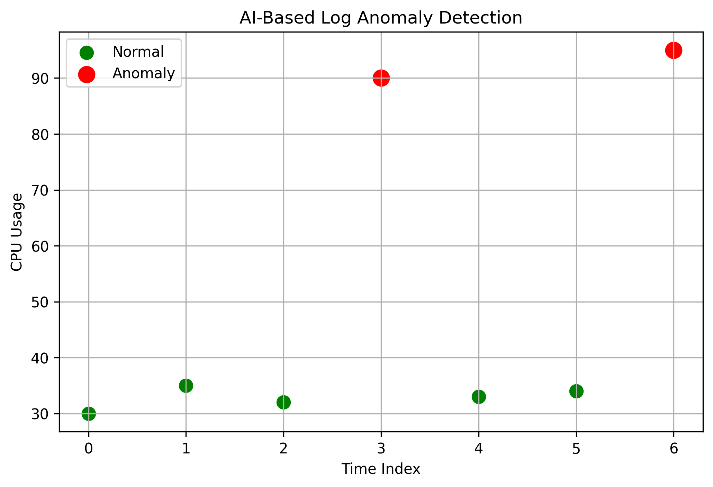

# AI Log Anomaly Detection System

An intelligent monitoring system that uses Machine Learning to automatically detect abnormal patterns in system logs.

This project demonstrates how AI can be applied to real-world cloud infrastructure monitoring to identify rare and unexpected behavior without labeled training data.

---

## 🚀 Features

- Reads structured log data (CSV format)
- Applies Isolation Forest algorithm for anomaly detection
- Identifies abnormal system behavior automatically
- Visualizes normal vs anomaly events
- Clean Python implementation

---

## 🧠 Machine Learning Model

Algorithm Used:
Isolation Forest (unsupervised anomaly detection)

Why Isolation Forest?
It is efficient for detecting rare and abnormal patterns in high-dimensional datasets without requiring labeled training data.

---

## 📊 Sample Output

- Green points → Normal behavior  
- Red points → Anomalies detected  

---

## 🛠 Tech Stack

- Python
- Pandas
- Scikit-learn
- Matplotlib

---

## 📁 Project Structure

---

## ▶ How to Run

1. Clone the repository
2. Create virtual environment
3. Install dependencies
4. Run the application

---
## 🎯 Use Cases

- Server Monitoring
- Cloud Infrastructure Monitoring
- Application Log Analysis
- Cybersecurity anomaly detection
- DevOps monitoring systems

---
Built as part of my AI & Cloud Engineering portfolio.

